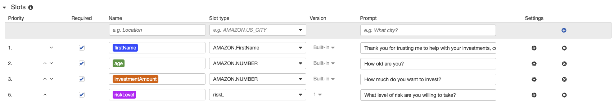

# Fintech--AWS

---

AWS LEX and Lambda funtions have been use to develop a chatbot designed to aid in collecting data and smoothening the process for providing retrement investment advice.

---
### Amazon LEX
Amazon LEX is a framework for developing and tuning chatbots, desgiend for use in mobile and web applications. The service provides all of natural language processing and logic for pseudonatural conversation. In this example, the bot was configured with only one intent, the ReccommendInvestment intent followed a fairly linear path, first aquiring data about the customer, and providing feedback in the form of investment advice based on the collected data.

---
### Lambda function
An Amazon Lambda function was used to customize the functionality and limit the parameters of investment advice by narrowing the possible data inputs. Amazon Lambda provided testing functionality directly in the UI which was invaluable in troubleshooting the script.